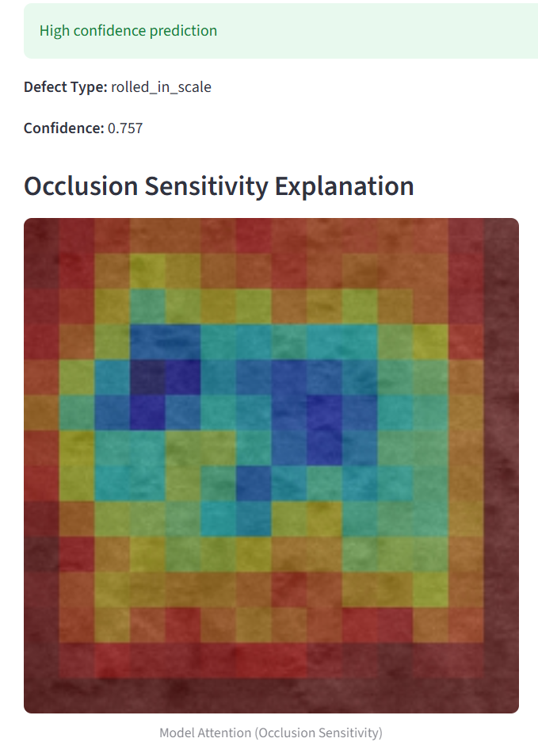

# 🏭 Industrial Steel Surface Defect Detection using Explainable AI

An **explainable deep learning–based system** for classifying surface defects in industrial steel images.  
The project demonstrates **transfer learning, model interpretability, and deployment best practices** using a clean and reproducible pipeline.

This system is designed to **assist human inspectors**, not replace them.

---

## 🔍 Problem Statement

Manual inspection of steel surfaces in manufacturing environments is:
- Time-consuming  
- Prone to human fatigue and inconsistency  
- Difficult to scale reliably  

Automated vision systems can help by **flagging probable defects** and **highlighting regions of interest** for further inspection.

---

## 🧠 Solution Overview

This project implements:

- **Image classification** for surface defect identification  
- **Transfer learning (MobileNetV2)** for efficient feature extraction  
- **Explainable AI (Occlusion Sensitivity)** to visualize model attention  
- **Confidence-based decision logic** to reject unreliable predictions  
- **Streamlit web interface** for interactive demonstration  

The emphasis is on **engineering correctness and transparency**, not just accuracy.

---

## 🧪 Defect Classes

The model classifies the following six defect types:

- Crazing  
- Inclusion  
- Patches  
- Pitted Surface  
- Rolled-in Scale  
- Scratches  

---

## 🖼️ Demo (Representative Example)

Below is a **high-confidence prediction example** with occlusion-based explainability:



> Screenshots show representative high-confidence examples for demonstration purposes.

---

## ⚠️ Important Note on Predictions

This system uses **confidence-based decision gating**.

- Predictions below a predefined confidence threshold are **intentionally rejected**
- This avoids misleading classifications on uncertain or out-of-distribution inputs
- Such behavior reflects **real-world industrial inspection systems**, where AI supports human judgment

---

## 🏗️ System Pipeline

1. Image input  
2. MobileNetV2-compatible preprocessing  
3. Defect classification  
4. Confidence threshold evaluation  
5. Occlusion sensitivity analysis  
6. Result visualization via UI  

---
## 📁 Project Structure
```
DeepDefect-CV/
├── app/
│ ├── app.py # Streamlit UI
│ └── defect_model.h5 # Trained model
│
├── src/
│ ├── train.py # Model training
│ └── occlusion.py # Explainability analysis
│
├── screenshots/
│ └── high_confidence_prediction_with_explanation.png
│
├── README.md
├── requirements.txt
├── .gitignore
└── .gitattributes
```
---

## 📌 Key Design Decisions

- **MobileNetV2** chosen for efficiency and deployability  
- **Occlusion Sensitivity** selected for model-agnostic explainability  
- **Confidence thresholds** added to handle uncertainty responsibly  
- **Dataset excluded** from repository due to size and licensing considerations  

---

## 🚧 Limitations

- The model is trained on a controlled dataset and may not generalize to all real-world conditions  
- Some defect classes have subtle visual differences  
- The system is intended as a **decision-support tool**, not a certified inspection solution  

---

## 🧑‍💻 Author

**Ponnarasan V**  
M.Tech – Computer Science & Engineering with specialization in Artificial Intelligence and Machine Learning,  
VIT Vellore  

---

## 📄 Disclaimer

This project is intended for **academic, demonstrative, and learning purposes** and is designed to support human decision-making rather than replace it.

